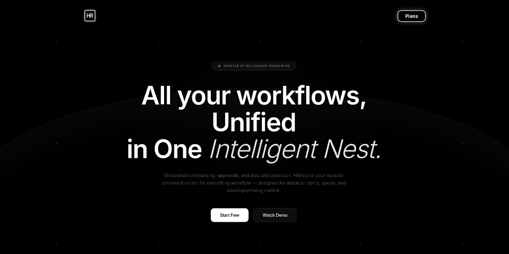

# HR Workflow Designer Prototype



## Project Overview
An HR admin tool designed to visually create and test internal workflows (such as onboarding, leave approval, and document verification) using a drag-and-drop canvas interface. Note that this is a frontend prototype demonstrating complex interactive diagramming without a physical backend.

## How to Run

1. **Install dependencies:**
   ```bash
   npm install
   ```

2. **Start the development server:**
   ```bash
   npm run dev
   ```

3. Open the browser link provided in the terminal (usually `http://localhost:5173`).

## 🚀 How to Deploy

This project is built with Vite and React, making it extremely straightforward to deploy as a modern static site.

### Option 1: Deploying to Vercel (Recommended)
1. Commit and push your code to your GitHub repository.
2. Log in to [Vercel](https://vercel.com/) and navigate to your dashboard.
3. Click **Add New** > **Project**.
4. Import your GitHub repository (`tredence-hr-workflow`).
5. Vercel will automatically detect the Vite framework. Keep the default settings:
   - **Framework Preset**: `Vite`
   - **Build Command**: `npm run build`
   - **Output Directory**: `dist`
6. Click **Deploy**. Your site will be live with a free HTTPS URL in less than a minute!

### Option 2: Deploying to Netlify
1. Log in to [Netlify](https://www.netlify.com/).
2. Click **Add new site** > **Import an existing project**.
3. Connect your GitHub account and authorize access to your repository.
4. Select the repository. Ensure the build settings are correctly populated:
   - **Build command**: `npm run build`
   - **Publish directory**: `dist`
5. Click **Deploy site**.

### Option 3: Manual Standard Hosting (Nginx / Apache / AWS S3)
If you need to host the application on your own infrastructure:
1. Run `npm run build` locally or in your CI/CD pipeline.
2. Vite will generate an optimized, minified production asset bundle inside the `dist/` directory.
3. Upload the entire contents of the `dist/` directory to your web server root or storage bucket.
4. If you add standard React Router later, ensure your server is configured to rewrite all requests pointing to `index.html`.

## Architecture Decisions

- **State Management**: Used Zustand instead of React Context for global state (nodes, edges, workflow properties, undo/redo history) since it provides better performance by avoiding unnecessary re-renders when managing complex graph state. It also simplifies the implementation of undo/redo hooks.
- **Component Structure**: Divided components into semantic domains: `nodes` for React Flow node types, `forms` for the configuration side-panel, `sidebar` for the drag-and-drop palette, and `sandbox` for the simulation engine. This maintains a clean separation of concerns.
- **Mock Service Worker (MSW)**: Chosen for API mocking as it operates at the network level rather than internal application logic, allowing the application to behave as if real network requests are being fulfilled. This lets the UI code remain 100% true to a production-ready state without hardcoded mock delays inside React components.
- **Form Controls**: Built custom controlled components instead of a heavy form library to ensure maximum compatibility and reactivity with Zustand updates on every keystroke, considering dynamic forms depend directly on the clicked node's type.

## Libraries Used and Why

- **Vite + React + TypeScript**: Fast build tool, unopinionated UI library (React), and strict typing to ensure high reliability for dynamic data structures like graphs and dynamic forms.
- **@xyflow/react (React Flow)**: The industry standard for interactive node-based UIs in React. It inherently provides the exact primitives needed: dragging nodes, rendering custom SVG edges, MiniMap, Controls, and viewport transformations.
- **Tailwind CSS v4**: Utility-first CSS framework for rapidly scaffolding the dark-themed UI and complex layout without context-switching between TS and CSS files.
- **Zustand**: A small, fast, and scalable bearbones state-management solution that is perfect for managing the global graph state locally without unnecessary boilerplate.
- **MSW (Mock Service Worker)**: To simulate backend API capabilities (`/automations` and `/simulate`) precisely at the network boundary.

## What's Implemented

- Complete React Flow drag-and-drop canvas environment.
- 5 distinctly styled and typed Node UIs (Start, Task, Approval, Automated, End).
- Interactive, context-aware properties panel for configuration.
- Top-level workflow canvas state (Undo, Redo, Import JSON, Export JSON).
- Mock Integration (`/automations`) for dynamically loading automation actions.
- Workflow Validation checks (Only one start node, at least one end node, cycle detection, disconnected node detection).
- Sandbox Simulator timeline with topological sorting and execution sequence rendering.

## What Would Be Added With More Time

- **Complex Routing Algorithms**: Orthogonal or custom SVGs for edge routing to keep large workflows cleaner visually.
- **Copy/Paste**: Keyboard shortcuts for copying and pasting sub-graphs.
- **Collapsible Nodes/Groups**: The ability to group steps (e.g., multiple tasks under one Phase) into a bounding box node.
- **Real Backend Integration**: Exchanging MSW for actual API endpoints with persisted databases (e.g., PostgreSQL).
- **Authentication/Authorization**: Role-based access control where HR Admins can edit, but Employees can only trigger or view workflows.
- **End-to-End Testing**: Cypress or Playwright tests simulating the complete drag-and-drop pipeline.
